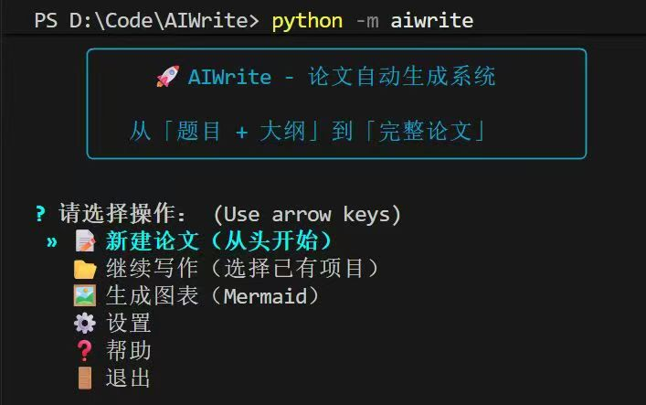
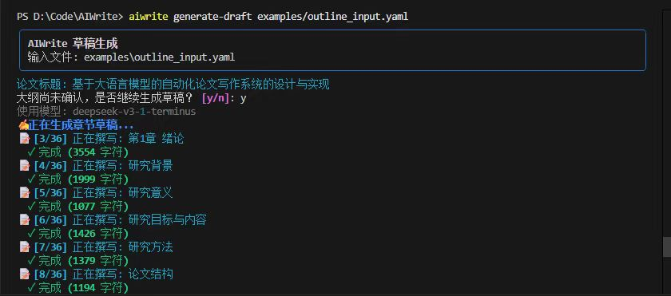
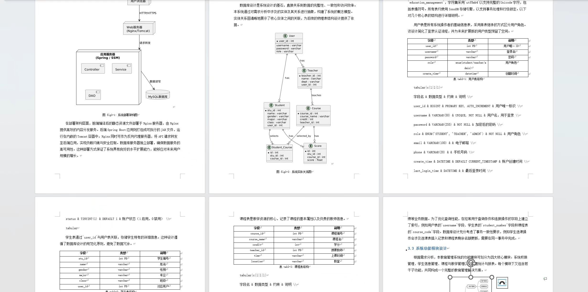

# AIWrite

> 基于多模型协作的自动化学术论文写作工具，从题目/大纲到 LaTeX/Word 成稿。

## 功能特性
- 多模型流水线：思考模型生成大纲，写作模型产出正文，视觉模型识别图像并撰写描述。
- Mermaid 渲染：本地生成流程图、时序图、ER/class/mindmap/pie 等。
- 双格式输出：同时导出 LaTeX 与 Word，支持跳过润色或摘要等可选步骤。
- 断点续写：分阶段执行 pipeline，可随时查看进度并重跑单步。
- 可定制提示词：模板化 prompts，方便替换模型或调整风格。

## 快速开始
### 1) 安装
- 需要 Python 3.10+
```bash
git clone https://github.com/48fortyeightc/AIWrite.git
cd AIWrite
pip install -e .
# 若要本地渲染 Mermaid 图表
playwright install chromium
```

### 2) 启动与配置
- 运行入口就是命令 `aiwrite`（或 `python -m aiwrite`），安装完成后可直接在终端调用，无需额外脚本。
- 配置环境变量（不要提交 API Key）：
- 复制 `.env.example` 为 `.env`，填入你的密钥和模型配置。
- `.env` 已在 `.gitignore` 中，默认不会被上传；若曾误加可执行 `git rm --cached .env` 解除跟踪。
- 示例：
```bash
THINKING_API_KEY=your_thinking_api_key_here
THINKING_BASE_URL=https://ark.cn-beijing.volces.com/api/v3
THINKING_MODEL=doubao-seed-1-6-thinking-250715

WRITING_API_KEY=your_writing_api_key_here
WRITING_BASE_URL=https://api.deepseek.com/v1
WRITING_MODEL=deepseek-v3-1-terminus

# 备选写作模型（可选）
WRITING_ALT_API_KEY=your_alt_api_key_here
WRITING_ALT_BASE_URL=https://api.moonshot.cn/v1
WRITING_ALT_MODEL=kimi-k2-thinking-251104
```

### 3) 生成论文
```bash
# 从纯文本大纲创建配置
aiwrite init -t "基于 Spring Boot 的人事管理系统设计与实现" -o hrm.yaml -i examples/img2 -w 15000

# 生成各章节初稿（LaTeX）
aiwrite generate-draft hrm.yaml

# 润色 + 摘要 + 导出 LaTeX/Word
aiwrite finalize hrm.yaml -o output/hrm -i examples/img2
```
使用 `aiwrite status hrm.yaml` 查看当前进度。

## 常用命令
| 命令 | 作用 |
| --- | --- |
| `aiwrite init` | 从纯文本大纲初始化 YAML 配置 |
| `aiwrite suggest-outline <file>` | 为现有 YAML 补全详细小节 |
| `aiwrite generate-draft <file>` | 生成各章节 LaTeX 草稿 |
| `aiwrite finalize <file>` | 润色/摘要并导出 LaTeX/Word |
| `aiwrite analyze-images <file>` | 识别图片并更新章节描述 |
| `aiwrite status <file>` | 查看当前进度 |

## 目录结构
```
AIWrite/
├── aiwrite/           # 核心代码：LLM、pipeline、渲染、工具
├── examples/          # 示例 YAML 与图片
├── output/            # 生成的 LaTeX/Word（建议不提交）
├── tests/             # 单元测试
├── .env.example       # 环境变量示例（复制为 .env）
├── pyproject.toml     # 项目与依赖声明
└── README.md
```

## 界面预览
- 首页：
- 大纲生成：
- 论文导出示例：

## 开发/测试
```bash
pip install -e ".[dev]"
pytest
```

## 贡献
欢迎提交 Issue 或 Pull Request，一起完善 AIWrite。

## License
MIT License
